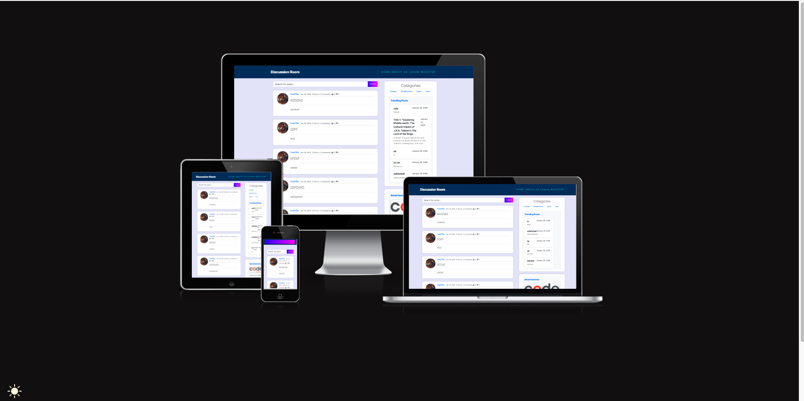

# Discussion Room

## Introduction

Discussion Room is a user-friendly forum application designed to facilitate engaging and structured discussions among users. Built with Django, this project serves as my Project 4 for the CodeInstitute Full Stack Software Development Diploma. It provides a platform where users can create, share, and discuss topics of interest, fostering a collaborative environment for exchanging ideas and knowledge.

## User Stories 

1. User Login Functionality

* As a registered user, I want to log in to my account so that I can access my personalized content and participate in discussions.

2. User Registration and Authentication

* As a new user, I want to register for an account so that I can start participating in discussions.
* As a user, I want to log out of my account for security reasons when I’m finished using the platform.

3. Post Creation Functionality

* As a user, I want to create new posts on topics of my choice so that I can share my opinions and ideas with others.

4. Post Editing Functionality

* As a user, I want to edit my posts so that I can correct mistakes or update information after it has been published.

5. Comment Deletion Functionality

* As a user, I want to delete comments I have made so that I can remove anything I no longer wish to be visible.

6. Post Deletion Functionality

* As a user, I want to delete my posts if I want to remove them from the platform entirely.

7. Comment Editing Functionality

* As a user, I want to edit my comments so that I can fix errors or add additional information to my original thoughts.

8. User Account Management for Admins

* As an admin, I want to manage user accounts so that I can enforce community guidelines and maintain a safe environment for discussions.
* As an admin, I want to view user activity to monitor interactions and ensure compliance with the platform's standards.

9. Commenting Functionality

* As a user, I want to comment on posts to express my thoughts and engage in discussions with other users.

### Admin Stories

1. User Account Management

* As an admin, I want to create user accounts so that new users can register and participate in discussions.
* As an admin, I want to view a list of all user accounts so that I can manage user access and activity.
* As an admin, I want to disable or delete user accounts so that I can remove users who violate community guidelines or no longer participate.

2. Post Management

* As an admin, I want to view all posts on the platform so that I can monitor discussions and ensure they align with community standards.
* As an admin, I want to delete posts that are inappropriate or violate community guidelines so that I can maintain a respectful discussion environment.
* As an admin, I want to edit posts to correct any misinformation or update content when necessary.

3. Comment Management

* As an admin, I want to view all comments made on posts so that I can ensure discussions remain constructive.
* As an admin, I want to delete comments that are offensive or inappropriate to keep the platform safe for users.
* As an admin, I want to manage reported comments or posts that users flag to investigate and take appropriate action.

4. Moderation Tools

* As an admin, I want to receive notifications about user reports on posts or comments so that I can respond promptly and uphold community standards.
* As an admin, I want to ban users for repeat offenses to protect the community from disruptive behavior.

### Website Goals

1. Foster Community Engagement:

* Create a welcoming space where users can freely discuss various topics, share ideas, and connect over shared interests.
* Encourage users to participate by providing tools for posting, commenting, and liking content.

2. Facilitate Knowledge Sharing:

* Provide a platform where users can ask questions and receive answers, promoting learning and understanding within the community.
* Highlight valuable contributions through features such as trending posts or top contributors.

3. Ensure User Safety and Moderation:

* Implement moderation tools and guidelines to maintain a respectful environment.
* Create mechanisms for users to report inappropriate content, helping to manage community standards effectively.

4. Enhance User Experience:

* Design a user-friendly interface that is easy to navigate, enabling users to quickly find discussions relevant to their interests.
* Optimize the site for responsiveness across various devices, ensuring accessibility for all users.

5. Support User Account Management:

* Allow users to easily register, log in, and manage their profiles, posts, and comments.
* Implement account security measures to protect user data and privacy.

6. Implement Robust Search and Filter Options:

* Provide powerful search functionality and category filtering to help users find specific discussions or topics quickly.
* Enhance user engagement by making content discovery intuitive and straightforward.

6. Promote Interaction through Notifications:

* Keep users informed about replies to their comments, likes, and new posts relevant to their interests, encouraging them to return to the site.
* Use notifications strategically to enhance user engagement and activity on the platform.

### Requirements 

* Landing page.
* About section.
* User registration and login.
* Post creation and management.
* Commenting functionality.
* Categories for filtering posts.
* Search functionality for posts.
* Trending posts section.
* User profile management.
* Admin dashboard access.
* CRUD functionality for posts and comments.
* User notifications system.
* Responsive design.
* Links to social media.