# Discussion Room

## Introduction

Discussion Room is a user-friendly forum application designed to facilitate engaging and structured discussions among users. Built with Django, this project serves as my Project 4 for the CodeInstitute Full Stack Software Development Diploma. It provides a platform where users can create, share, and discuss topics of interest, fostering a collaborative environment for exchanging ideas and knowledge.

## User Stories 

1. User Login Functionality

* As a registered user, I want to log in to my account so that I can access my personalized content and participate in discussions.

2. User Registration and Authentication

* As a new user, I want to register for an account so that I can start participating in discussions.
* As a user, I want to log out of my account for security reasons when I’m finished using the platform.

3. Post Creation Functionality

* As a user, I want to create new posts on topics of my choice so that I can share my opinions and ideas with others.

4. Post Editing Functionality

* As a user, I want to edit my posts so that I can correct mistakes or update information after it has been published.

5. Comment Deletion Functionality

* As a user, I want to delete comments I have made so that I can remove anything I no longer wish to be visible.

6. Post Deletion Functionality

* As a user, I want to delete my posts if I want to remove them from the platform entirely.

7. Comment Editing Functionality

* As a user, I want to edit my comments so that I can fix errors or add additional information to my original thoughts.

8. User Account Management for Admins

* As an admin, I want to manage user accounts so that I can enforce community guidelines and maintain a safe environment for discussions.
* As an admin, I want to view user activity to monitor interactions and ensure compliance with the platform's standards.

9. Commenting Functionality

* As a user, I want to comment on posts to express my thoughts and engage in discussions with other users.

### Admin Stories

1. User Account Management

* As an admin, I want to create user accounts so that new users can register and participate in discussions.
* As an admin, I want to view a list of all user accounts so that I can manage user access and activity.
* As an admin, I want to disable or delete user accounts so that I can remove users who violate community guidelines or no longer participate.

2. Post Management

* As an admin, I want to view all posts on the platform so that I can monitor discussions and ensure they align with community standards.
* As an admin, I want to delete posts that are inappropriate or violate community guidelines so that I can maintain a respectful discussion environment.
* As an admin, I want to edit posts to correct any misinformation or update content when necessary.

3. Comment Management

* As an admin, I want to view all comments made on posts so that I can ensure discussions remain constructive.
* As an admin, I want to delete comments that are offensive or inappropriate to keep the platform safe for users.
* As an admin, I want to manage reported comments or posts that users flag to investigate and take appropriate action.

4. Moderation Tools

* As an admin, I want to receive notifications about user reports on posts or comments so that I can respond promptly and uphold community standards.
* As an admin, I want to ban users for repeat offenses to protect the community from disruptive behavior.

### Website Goals

1. Foster Community Engagement:

* Create a welcoming space where users can freely discuss various topics, share ideas, and connect over shared interests.
* Encourage users to participate by providing tools for posting, commenting, and liking content.

2. Facilitate Knowledge Sharing:

* Provide a platform where users can ask questions and receive answers, promoting learning and understanding within the community.
* Highlight valuable contributions through features such as trending posts or top contributors.

3. Ensure User Safety and Moderation:

* Implement moderation tools and guidelines to maintain a respectful environment.
* Create mechanisms for users to report inappropriate content, helping to manage community standards effectively.

4. Enhance User Experience:

* Design a user-friendly interface that is easy to navigate, enabling users to quickly find discussions relevant to their interests.
* Optimize the site for responsiveness across various devices, ensuring accessibility for all users.

5. Support User Account Management:

* Allow users to easily register, log in, and manage their profiles, posts, and comments.
* Implement account security measures to protect user data and privacy.

6. Implement Robust Search and Filter Options:

* Provide powerful search functionality and category filtering to help users find specific discussions or topics quickly.
* Enhance user engagement by making content discovery intuitive and straightforward.

6. Promote Interaction through Notifications:

* Keep users informed about replies to their comments, likes, and new posts relevant to their interests, encouraging them to return to the site.
* Use notifications strategically to enhance user engagement and activity on the platform.

### Requirements 

* Landing page.
* About section.
* User registration and login.
* Post creation and management.
* Commenting functionality.
* Categories for filtering posts.
* Search functionality for posts.
* Trending posts section.
* User profile management.
* Admin dashboard access.
* CRUD functionality for posts and comments.
* User notifications system.
* Responsive design.
* Links to social media.

## Design Choices 

### Fonts

[Google Fonts](https://fonts.google.com/ "Google Fonts") The Discussion Room website utilizes [Poppins](https://fonts.google.com/specimen/Poppins) for headings, ensuring a modern and clean aesthetic, while Arial serves as the primary font for body text due to its simplicity and readability.

### Colours

1. rgb(230, 230, 250)

Purpose: Background color for the body of the website, creating a soft and inviting atmosphere.

2. #444444

Purpose: Primary text color for headings (h1, h2, etc.) and paragraphs (p), ensuring good readability.

3. rgba(30, 15, 45, 1) and rgba(70, 50, 120, 1)

Purpose: Used in the background of the .bg-steel class, providing a linear gradient effect that adds visual interest.

4. #003366

Purpose: Background color for the custom navbar, giving it a deep, professional look.

5. #d1e7dd

Purpose: Color for navigation links in the navbar, creating a clear contrast against the navbar background.

6. #ffffff

Purpose: Hover color for navigation links, ensuring visibility and interaction clarity.

7. #fefefe

Purpose: Background color for sections with the .content-section class, creating a clean and light appearance for content areas.

8. #000000

Purpose: Primary color for article titles, providing a strong contrast that makes the titles stand out.

9. #908690

Purpose: Hover color for article titles, adding a subtle change to indicate interactivity.

10. #dcdcdc

Purpose: Border color for .article-metadata, providing a subtle division between metadata and content.

11. #f5f5f5

Purpose: Background color for comments, ensuring they are distinguishable from the main content area.

12. #007bff

Purpose: Color for links in notifications and other emphasized text, providing a vibrant, clickable appearance.

13. #6c757d

Purpose: Default color for navbar links, offering a neutral tone that fits well within the overall design.

14. #343a40

Purpose: Default button background color, providing a dark contrasting color that highlights interactive elements.

15. #495057

Purpose: Button hover color, slightly lighter than the default, enhancing the visual indication when a user interacts with buttons.

16. #e6e6fa

Purpose: Text color for welcome messages, contributing to a lighter overall tone for user greetings.

17. #121212 and #ffffff (used in dark mode styles)

Purpose: Background and text colors respectively for dark mode support, ensuring sufficient contrast and readability.

18. #f8f9fa

Purpose: Background color for the account section and highlights, contributing to a clean and modern look.

19. #03e9f4

Purpose: Color used for various hover effects and highlights, providing a vibrant shade that draws attention.

20. #b2c39c

Purpose: Hover color for authentication links, creating an appealing visual effect when interacted with.

21. #777575

Background for content sections in dark mode.

22. #28a745

Color used for likes, visually indicating positive feedback or approval.

23. #dc3545

Color used for dislikes, indicating negative feedback or disapproval.

24. #FFA500

Color used for Code Institute promotional links, drawing attention and encouraging user interaction.

## Dark Mode Specific Colors

1. #000000

This is used as the background color for the entire site when dark mode is activated

2. Primary Text Color:

#FFFFFF: This is the primary text color used in dark mode to ensure high contrast against the black background for legibility.

3. Comment Background:

#777575: This color is assigned to the background of comments when dark mode is active, distinguishing them from the main content.

4. Highlight Color for Effects:

#03e9f4: This color is often used for elements that require attention, such as links or buttons, maintaining visibility in dark mode.

5. Muted Text Color:

#E6E6FA: This is a subtle, softer color reserved for muted text in dark mode, providing a visual hierarchy without causing strain against the darker background.

## Color Choices 

Certainly! Here’s a suggested text to add to your README file regarding the color choices and a note about the potential for missing colors, along with an improvised touch to enhance the tone:

Color Choices
In developing the Discussion Room project, I've carefully selected and noted the colors used to create an engaging and visually appealing website. The goal was to design a platform that not only facilitates discussions but also captures the attention of users through thoughtful color usage.

The colors chosen aim to provide a harmonious balance that enhances readability, establishes a welcoming atmosphere, and encourages interaction. Here is a comprehensive list of the colors used, along with their purposes.

While I have made an effort to document all the colors in use, it’s possible that a few may have been overlooked in the process. Should any colors be missing, they will be added to future updates as we continue to enhance the user experience and aesthetic appeal of the site.

By implementing this color scheme, I aspire to create a vibrant yet cohesive environment that invites users to explore, share, and engage in meaningful conversations within the community.

## Color Palette 

For the color palette, I used [Color Palette](https://coolors.co/).

## Icons

The icons used for the site were sourced from [Font Awesome](https://fontawesome.com/ "Font Awesome")

## Structure

The Discussion Room provides a simple yet engaging web platform, aiming to establish its unique color scheme and style. The navigation bar includes several links, offering quick access to various sections, such as About Us, Create a Post, Home Page, Logout, and the Notifications Page.

The footer features additional links for Highlights, Collaboration Requests, About the Team, and the Admin Page, ensuring users can easily find important information. 

Additionally, the site includes a Trending Topics section that showcases random posts and a dedicated Advertisement Window for promotional content. Above the trending topics, users will find Categories to help them navigate discussions more effectively.

To fully engage with the content—whether by commenting or posting—users must register for an account, fostering a community of committed participants.

### Database Models

User Profile (Account): 

| Object             | Field           |
|--------------------|-----------------|
|      user          |  OneToOneField  |
|      avatar        | CloudinaryField |

Post: 

| Object         | Field           |
|----------------|-----------------|
|   title        |    CharField    |
|  content       |    TextField    |
|  author        |    ForeignKey   |
| date_posted    |   DateTimeField |
| category       |   ForeignKey    |

Comment: 

| Object         | Field           |
|----------------|-----------------|
|   content      |    TextField    |
|    post        |    ForeignKey   |
|    author      |    ForeignKey   |
|  created_at    |  DateTimeField  |
|   likes        |   IntegerField  |
|  dislikes      |   IntegerField  |
|   parent       |    ForeignKey   |

Notification: 

| Object         | Field           |
|----------------|-----------------|
|   user         |    ForeignKey   |
|  message       |    CharField    |
|  is_read       |    BooleanField |
| created_at     |    DateTimeField|
| comment        |    ForeignKey   |

Category: 

| Object         | Field           |
|----------------|-----------------|
|   name         |    CharField    |

## Wireframes

Wireframes have been created using [Balsamic](https://balsamiq.com "Balsamic"). These wireframes provided an initial blueprint for the layout of my forum project. However, the design evolved and adapted throughout the development process, resulting in some changes in the final product.

*Main Page Desktop Wireframe* 

*Main Page Mobile Wireframe* 

*About Us Desktop Wireframe* 

*About Us Mobile Wireframe* 

*Create Post Desktop Wireframe* 

*Create Post Mobile Wireframe* 

*Account Page Desktop Wireframe* 

*Account Page Mobile Wireframe* 
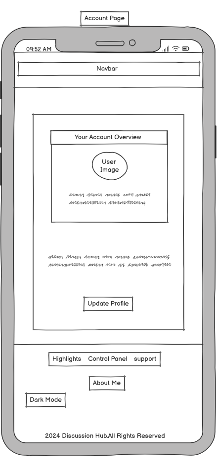

*Logged Out Window Desktop Wireframe* 

*Logged Out Window Mobile Wireframe* 

*Notifications Page Desktop Wireframe* 

*Notifications Page Mobile Wireframe* 

*About Me Page Desktop Wireframe* 

*About Me Page Mobile Wireframe* 

*Support Page Desktop Wireframe* 

*Support Page Mobile Wireframe* 

*Highlights Page Desktop Wireframe* 

*Highlights Page Mobile Wireframe* 

*Reading Post Desktop Wireframe* 

*Reading Post Mobile Wireframe* 

## Note

As with many forums and web pages, the mobile wireframe reflects the layout users will see when they interact with the site on smaller screens. When viewing the forum on mobile, users will need to scroll down to access all content on the page. The design shown in the mobile wireframe illustrates the initial view, while scrolling reveals the complete set of features and discussions.

## Features 

### Navbar

The navbar is designed to be simple and user-friendly. When a user is logged out, the left side displays the name of the forum, Discussion Room, which serves as a direct link to the home page. On the right side, there are links for Home, About Us, Login, and Register sections. This straightforward layout ensures easy navigation without any complex features, allowing users to quickly access key areas of the website.

The navbar includes hover effects that enhance the user experience for all users, whether logged in or not. The title Discussion Room features a distinct hover effect that draws attention, while the links present in the navbar also have their own hover styles, providing clear visual feedback when users interact with the navigation elements.

*Navbar Logged Out* 

### Navbar Logged In

When a user is logged in, the navbar retains the Discussion Room name on the left side, serving as a direct link back to the home page. In the center, a welcome message appears, greeting the user with "Welcome, User!" 

The navbar includes links to the Home and About Us pages, accessible to both logged-in and logged-out users. Additionally, it features a Create a New Post section that allows users to initiate discussions. 

Users can manage their profiles via the Account link, log out using the Logout button, and access the Notifications page to view replies to comments they have posted. This layout promotes ease of access and enhances the overall user experience.

*Navbar Logged In* 

### Mobile Navbar

The mobile version of the navbar features a collapsible design that enhances usability on smaller screens. When the user touches the navbar at the top of the screen, it expands downwards to reveal all sections. This functionality ensures that users can easily access important links, regardless of whether they are logged in or logged out.

Both logged-out and logged-in users will see the following sections:

Discussion Room: A link back to the home page.
* Welcome Message: Displayed for logged-in users.
* Home: Accessible to all users.
* About Us: Accessible to all users.
* Create a New Post: Available for logged-in users.
* Account: Access to user profile for logged-in users.
* Logout: Available for logged-in users.
* Notifications: Link to see replies to comments for logged-in users.
* This collapsible navbar format provides a clean and efficient navigation experience, making it easy for users to engage with the forum content.

*Navbar Logged Out Mobile* 
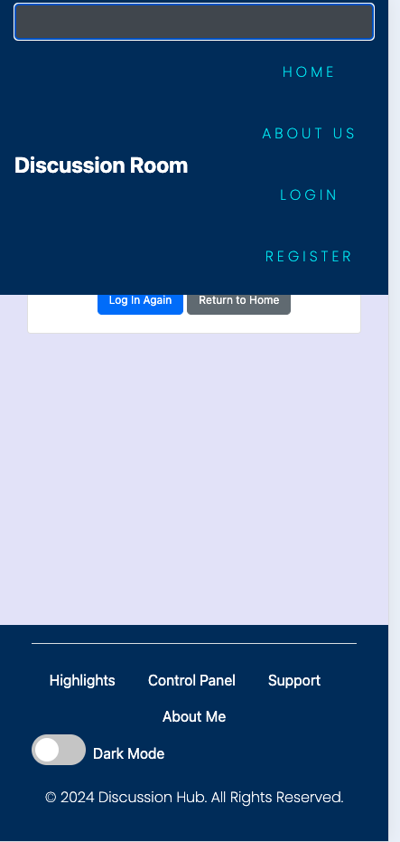

*Navbar Logged In Mobile* 

### Maine Page (Home Button)

The main page of the Discussion Room is designed to display 8 posts per page, with pagination functionality to navigate between different sets of posts easily.

At the top of the page, there is a search bar that allows users to search for posts using random words, titles, or phrases, enhancing content discovery.

On the right side of the page, there is a Trending Posts window that showcases random posts from the forum. This section refreshes each time the user reloads the page or navigates to another page, creating an engaging experience by introducing different content continually. The Trending Posts window is visible both to logged-in users and guests; however, to access any post from this section, users must log in.

At the top of the Trending Posts window, there are categories allowing users to filter posts. There are 4 categories available, each linking to the posts associated with that category, making it easier for users to find content of interest. 

Below the Trending Posts window, an Advertisement Window is included, which serves as a potential future feature to help maintain the forum project. This section can display ads relevant to the user base, providing an opportunity for monetization or informative promotions. Although its implementation can be adjusted in the future, it currently serves as an example of what may enhance the user experience.

*Maine Page Desktop* 

### Main Page Mobile (Home Button )

The mobile version contains the same features as the desktop version; however, users need to scroll down to access some functions, including the Trending Posts window, categories, and the Advertisement Window. This scrolling functionality is common in many forum projects.

*Maine Page Mobile* 

### About Us 

In the About Us section, you'll find information about the Discussion Room forum, including the community rules that guide our interactions. This window can be accessed by both logged-in and logged-out users. We aim to create a welcoming environment where individuals can engage in discussions on various topics with kindness and respect.

Participants are encouraged to share their thoughts, ask questions, and connect with others, fostering a vibrant community that values diverse perspectives.

Community guidelines ensure a positive experience for all users, with a strong emphasis on constructive dialogue and mutual respect. We are dedicated to maintaining an inclusive space for everyone.

*About Us Desktop* 

*About Us Mobile* 
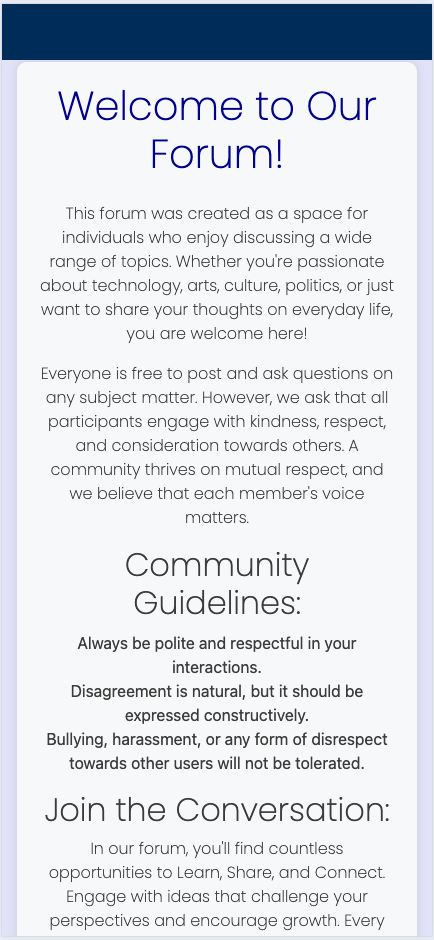

### Create A New Post

In the Create a New Post section, users can easily compose and publish new posts. This simple and intuitive interface includes fields for the post title, content, and a choice of category. Once the post is ready, users can click the Publish button to share it with the community. 

For those who wish to cancel the action, there is an option to go back, allowing users to navigate away without creating a new post.

*Create A New Post Desktop* 

*Create A New Post Mobile* 

### Account

In the Account Section, users are presented with a visually appealing window that displays their profile picture, name, and email address. This section also includes social media links, allowing users to navigate to their profiles or find inspiration for new posts and updates they wish to share.

Additionally, there is an Update Profile button that directs users to the profile editing page, enabling them to make changes to their account information as needed.

*Account Page Desktop* 

*Account Page Mobile* 
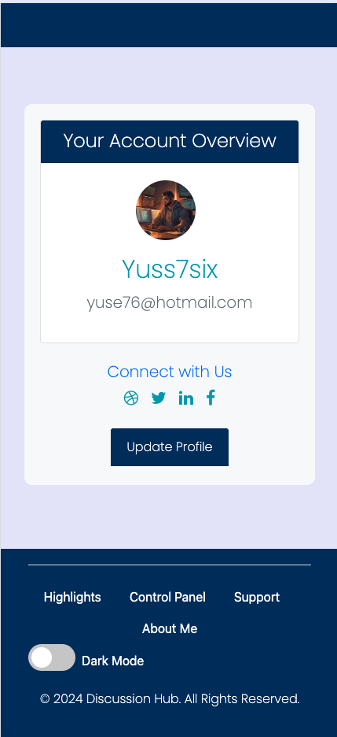

### Edit Your Profile Window

When users click the Update Profile button, they are taken to the Edit Your Profile window. In this section, users can update their name, email, and avatar image. After making the desired changes, users can save their updates, or if they wish to cancel, they have the option to go back without making any changes.

*Edit Your Profile Desktop* 

*Edit Your Profile Mobile* 
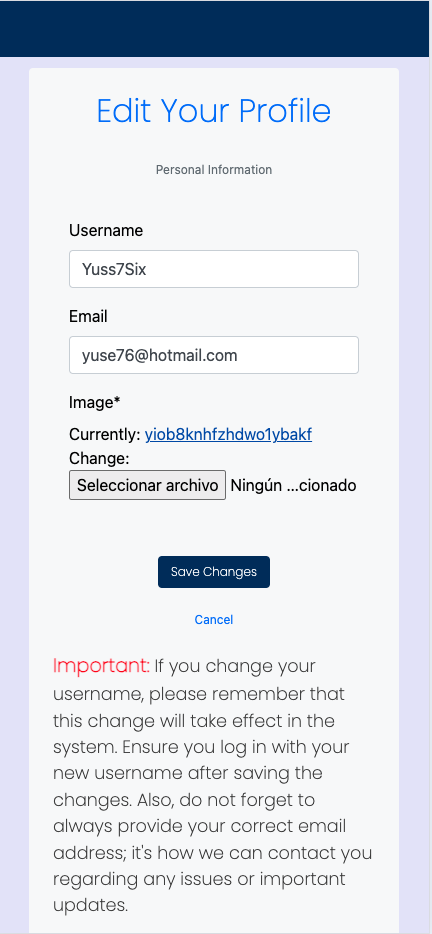

### LogOut

When users click the Logout button, they will be logged out of their account. Following this action, a notification window will appear, displaying a message that says, "You've been logged out." Additionally, users will see a message expressing, "We're sorry to see you go. Thank you for visiting our site," reinforcing a friendly atmosphere.

In this window, users will have two options: Log In Again to access their account or Return to Home Page to navigate back to the main section of the forum.

*Logout Page Desktop* 

*Logout Page Mobile* 

### Notifications

In the Notifications Page, users will see notifications for replies to comments they have posted on various forum posts. When users log in or when someone replies to their comment, a red dot will appear below the notification button, indicating that they have new notifications.

If there are no notifications, users will simply see a message stating that there are no notifications available, ensuring clear communication without unnecessary clutter.

*Notification Page Desktop* 

*Notification Page Mobile* 

*Red Dot* 

* In the Notifications Page, users will see notifications for replies to comments they have posted on various forum posts. If a user has notifications, they will see messages formatted as follows: "User [username] replied to your comment: [main comment content]." Each notification will include the date and time of the reply.Users will also have options to Delete the notification or Go to the comment, allowing them to manage their interactions effectively.

*Notification Page with Notification Desktop* 

*Notification Page with Notification Mobile* 
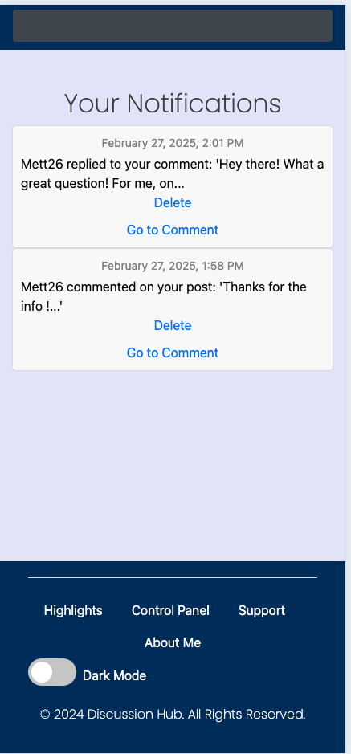

### About Me

In the About Me section, you'll learn about Yusein Ali, a 33-year-old with a diverse life journey. Born in Burgas, Bulgaria, he moved to Spain in 2001, pursued his passion for football in Turkey, and later returned to Bulgaria. In 2013, he moved to Luxembourg, where he continued to play football until relocating to Sweden in 2023.

Yusein has a border collie named Molly and is multilingual, speaking several languages including Bulgarian, Spanish, French, English, Turkish, Italian, Portuguese, and Luxembourgish, with Swedish currently being learned.

His passion for technology began in childhood, leading him to enroll in Code Institute in 2023 to enhance his programming skills. This forum, Discussion Room, is his fourth project out of five developed through Code Institute, inspired by the popular Spanish forum Forocoches.com.

Thank you for visiting and exploring the forum, where a welcoming space is provided for sharing and discussing ideas!

*About Me Page Desktop* 

*About Me Page Mobile* 
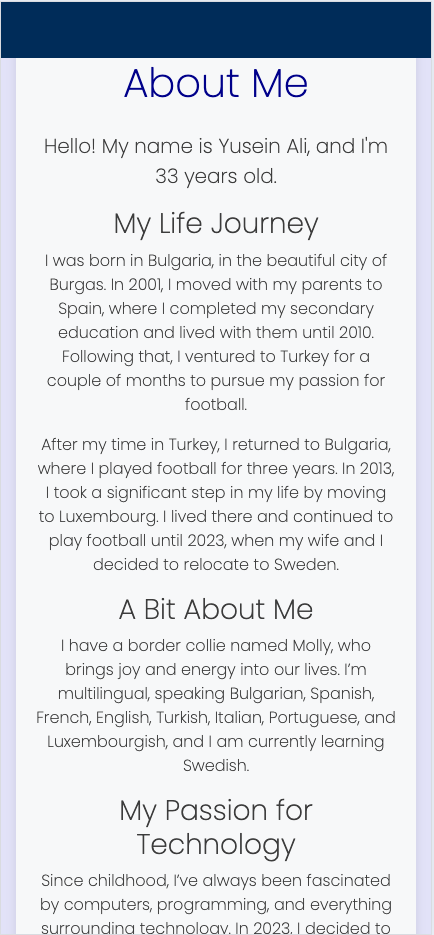

### Support & Collaboration

In the Support and Collaboration section, users can easily get in touch with the administration team. They have the ability to report unusual activities or inappropriate behavior from users who disrespect others. Additionally, users can submit requests for collaboration or suggestions to enhance the forum.

The section includes fields for users to enter their name, email (to facilitate contact), and a message detailing their inquiry or report. Once completed, users can submit their information using the Submit button, ensuring their concerns and ideas are communicated effectively.

*Support & Collaboration Desktop* 

*Support & Collaboration Mobile* 

### Admin Page (Control Panel)

The Admin Page (Control Panel) serves as the central control hub for administrators, granting them full rights to manage the forum effectively. Admins have the authority to monitor user activity, ensuring that community standards are upheld.

Through this page, admins can delete offensive posts and comments, as well as take necessary action against users who violate the forum rules. This functionality ensures a safe and respectful environment for all participants within the Discussion Room community.

*Admin Page Desktop* 

*Admin Page Mobile* 

### Highlights

In the Thank You section, I want to express my heartfelt gratitude to Code Institute for making this project a reality. Their extensive resources and support have been instrumental in building my project and pursuing my passion for web development.

I extend special thanks to all the tutors who were always available to assist whenever I needed help. Your expertise and guidance greatly impacted my learning journey.

A special thank you goes to my amazing mentor, Iuliia Konovalova, for your unwavering support and mentorship. Your encouragement and insights helped me navigate through challenges and stay motivated.

I would also like to thank the GitHub team for providing an incredible platform that enabled effective collaboration and development of my project.

For more information about Code Institute, visit their website: https://codeinstitute.net/se/

*Highlights Page Desktop* 

*Highlights Page Mobile* 

### Reading Post

Users will have the option to read posts in full detail, but this feature is only accessible to individuals who have an account and are logged in. On the right side of each post, there will be access to the Trending Posts window and available Categories, allowing users to easily explore related content.

Additionally, an Advertisement Window will be present, providing links to external advertisements. When a user clicks on an advertisement, a new page will open, directing them to the advertised content.

Each post container will include:

* A space for the user's image.
* The date and time of publication.
* The author's name.
* Like and dislike counters, along with a comment counter to track user engagement.
* Edit and delete options for the post, which will be visible only to the author of the post, indicated by pencil and trash icons.
At the top of the page, there will also be a search bar, enabling users to search for specific posts or keywords, enhancing content discovery and accessibility.

*Post Detail Page Desktop* 
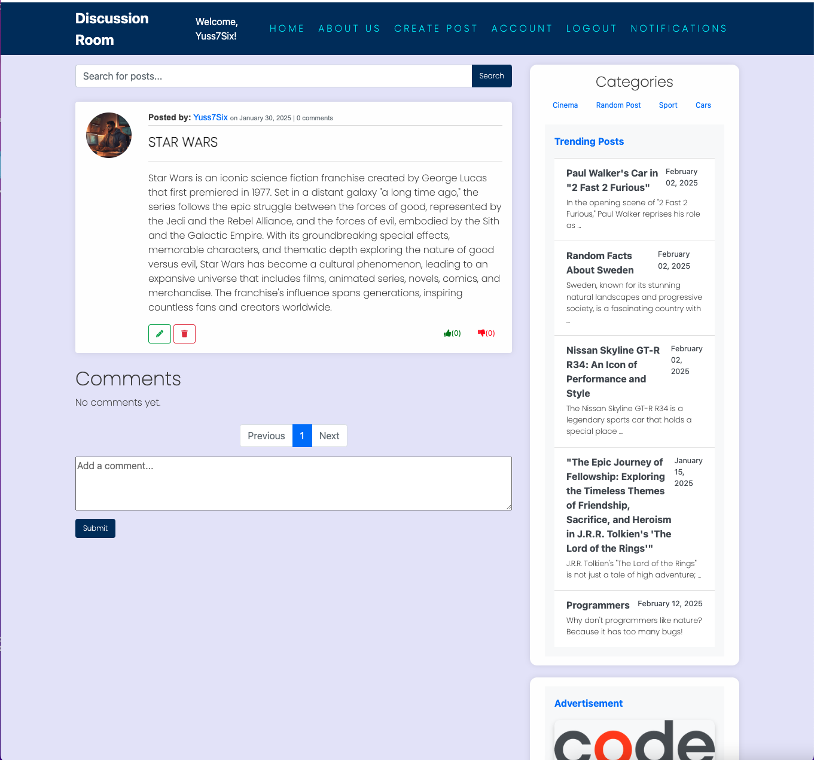

*Post Detail Page Mobile* 

### Update Post

When users access the update post option from the post they have published, indicated by the pencil icon, they will be brought to a dedicated window. In this section, users can view their existing post, where they can update the title and content as needed. Once they have made the necessary changes, they can republish the post, ensuring that their updates are reflected in the forum.

*Update Post Desktop* 

*Update Post Mobile* 

### Delete Post

When users click on the trash icon associated with their published post, they will be prompted with a confirmation window. This window will ask if they are sure they want to delete the post, clearly stating that this action cannot be undone. Users will have the option to confirm the deletion, cancel the action to retain the post, or return to the home page, ensuring flexibility during the decision-making process.

*Delete Post Desktop* 
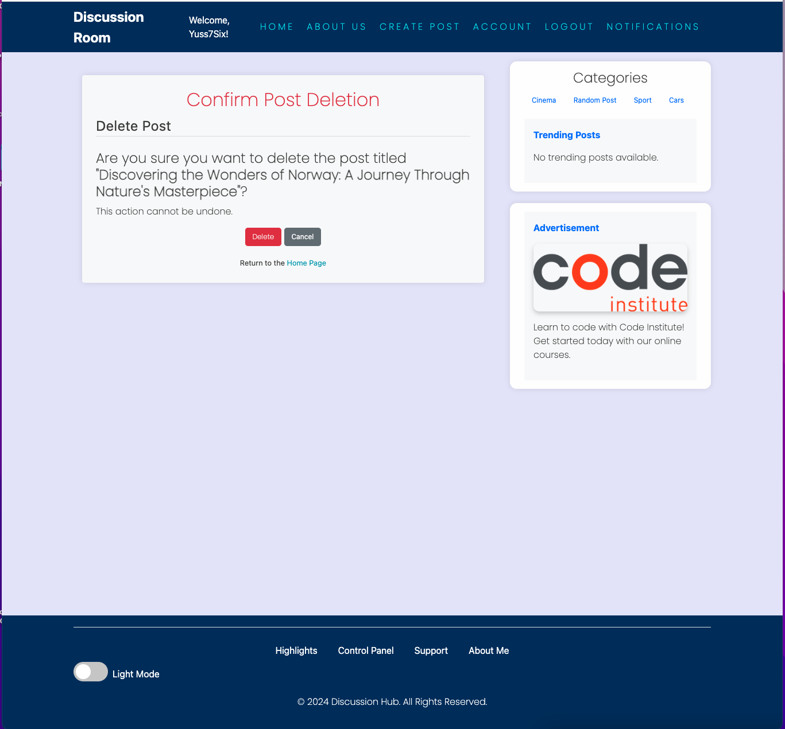

*Delete Post Mobile* 

### Commenting Functionality

Users will have the option to comment on a post, reply to comments made by other users, and like or dislike those comments. In the comment window, users can see the name of the commenter, along with the date and time of the comment.

Each post will display 6 comments per page, with pagination activated to navigate through additional comments as needed.

*Commentin Functionality Desktop* 

*Commentin Functionality Mobile* 

### Footer

The footer is positioned at the bottom of the page and provides essential navigation options. It includes links to the Highlights page, Control Panel, Support and Collaboration, and About Me page. 

These links are accessible to both logged-in and logged-out users, ensuring that everyone can explore the content. However, the Control Panel link is restricted to authorized personnel only, while the other links remain available to all users.

*Footer Page Desktop* 

*Footer Page Mobile* 

### Footer Message

At the bottom of the page, users will find the following message:
© 2024 Discussion Hub. All Rights Reserved.
This statement reinforces the ownership and copyright of the content on the site.

*Footer Message* 

## Dark Mode

The Discussion Room includes a Dark Mode feature inspired by the user-friendly design of https://en.wikipedia.org/wiki/Django_(web_framework). This mode provides an alternative color scheme to reduce eye strain in low-light environments. Users can easily switch to Dark Mode, which is beneficial for those who prefer working with a dark screen, like myself at times.

To switch back to light mode, users can find the toggle option located in the bottom left corner of the page. This flexibility allows users to choose their preferred viewing experience while engaging with the forum content.

This Dark Mode feature is currently in a testing phase. If we find that users are not satisfied with it, we will consider suspending the feature and removing it. Conversely, if users enjoy it, we will seek to refine and enhance the experience further.

* This means the page is in Dark Mode

*Dark Mode Option* 

* This means the page is in Light Mode

*Dark Mode Option* 

## Navbar (Dark Mode)
The navbar in Dark Mode maintains the same structure as outlined in the previous navbar section. Users will find the same essential links: Home, About Us, Login, and Register. Both the Home and About Us links are accessible to logged-in users and those who are not registered.

The navbar also features hover effects for enhanced interactivity. The title Discussion Room has a unique hover effect, while the other links present different hover styles, creating an engaging and visually appealing navigation experience even in Dark Mode.

*Dark Mode Navbar* 

*Dark Mode Navbar* 

* The mobile version features a navbar that appears in a dark grey color. When users click on the navbar, it expands downwards to display all navigation links. This functionality is accessible to all users, whether logged in or not, ensuring that everyone can easily navigate to key areas of the forum without hassle.

*Dark Mode Mobile* 

## Main Page (Home Button Dark Mode)

The main page retains the same features discussed earlier and is enhanced with pleasant colors in dark mode for improved visibility. The navbar remains consistent, ensuring a familiar navigation experience.

* The search bar is styled in white, complemented by a dark grey search button featuring white text, creating a striking contrast.
* Post containers are displayed with a dark grey background, featuring titles in black and content in white for clear readability.
* User avatar images are presented within a white circular frame, adding a clean visual touch.
* User names and other data fields are displayed in white, maintaining legibility against the dark background.

On the right side, users will find:

* Categories highlighted in blue color, allowing for easy browsing of topics.
* Trending Posts showcased in a white container with black and grey text, ensuring that users can easily engage with popular discussions.
* An Advertisement Window featuring dark grey borders with a white background, providing a clear viewing area for promotional content.

At the bottom of the page, a white line visually separates the footer from the rest of the content. The footer includes essential links and a toggle switch for dark/light mode, allowing users to easily switch their viewing preference.

*Main Page Dark Mode* 

*Main Page Dark Mobile* 

*Categories, Trending Posts and Advertisment* 

*Footer Dark Mode* 

## Abous Us (Dark Mode)

The About Us page retains the same features as described previously, with a dark mode aesthetic. The container is set to a dark grey background, providing a comfortable viewing experience. The title is styled in a vibrant green color, complemented by white text for the body content, creating a visually appealing contrast that enhances readability in dark mode.

*About Us Dark Mode Desktop* 

*About Us Dark Mode Mobile* 

## Login Page (Dark Mode)

The Login Page in dark mode features a sleek design that enhances user experience. It includes input fields for username and password, both displayed in white to provide a strong contrast against the dark background, ensuring readability.

The Log In button is styled with a green border, adding a visually appealing touch. Below the login fields, users who do not have an account can find a prompt to sign up, presented in a nice blue color for emphasis.

A clean white line visually separates the footer from the login options. In the bottom left corner, there is a toggle for switching between dark and light modes, designed in blue to align with the overall color theme.

*Dark Mode Log In Page* .

*Dark Mode Log In Mobile* .
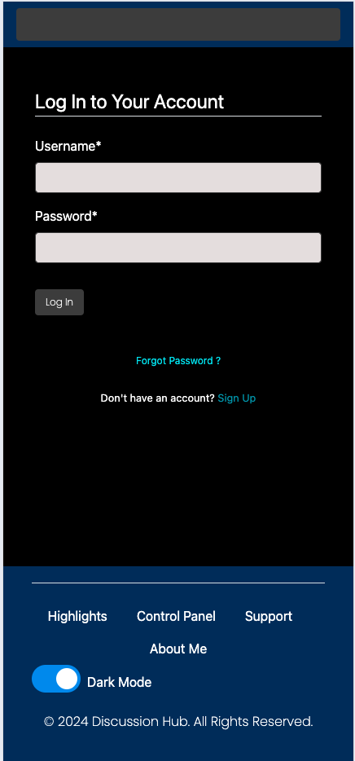

## Register Page(Dark Mode)

The Register Page in dark mode mirrors the structure of the Login Page, ensuring a consistent user experience. All input fields are displayed in white, with their corresponding labels also in white, creating a classic input style against the black background. 

* Password Requirements are also presented in white to maintain readability.
* The Register Now button features a nice blue border, providing a visually appealing call-to-action.
* Below the registration fields, the message for users who already have an account is displayed in white, accompanied by a Log In link styled in a nice blue color.

At the bottom of the page, a classic line separates the toggle for switching between light and dark modes from the footer, which is presented in a subtle grey color to provide a clear and elegant delineation.

*Register Page Dark Mode Desktop* 

*Register Page Dark Mode Desktop* 
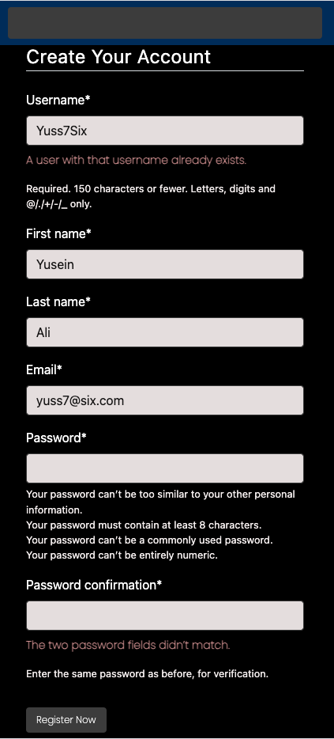

## Footer Section ( Dark Mode)

The footer in dark mode features a classic line that separates it from the main content window, providing a clean visual distinction. It includes links for Highlights, Control Panel, Support, and About Me, all styled in a nice grey color with a subtle hover effect for enhanced interactivity.

These links are accessible across all pages for both logged-in users and those without an account. However, the Control Panel link is reserved for administrative tasks and is only available to authorized personnel who can log in.

At the bottom of the footer, there is an "All rights reserved" message, ensuring clarity regarding content ownership. Additionally, the toggle for switching between dark and light modes is present; in dark mode, the toggle appears in blue, while in light mode, it is styled in grey, maintaining consistency with the overall theme.

*Footer In Dark Mode Desktop* 

*Footer In Dark Mode Mobile* 
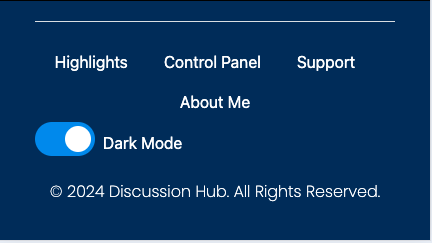

## About Me (Dark Mode)

The About Me page in dark mode features an elegant grey window that creates a visually appealing backdrop. The titles are displayed in a vibrant green color, while the content is presented in white letters, ensuring excellent readability. This combination of colors enhances the overall aesthetic and provides a comfortable experience for users navigating the page.

*About Me Dark Mode Desktop* 

*About Me Dark Mode Mobile* 

## Support & Collaboration Page (Dark Mode)

The Support and Collaboration page in dark mode opens with a nice blue title that creates an inviting atmosphere. Below the title, a submessage encourages users to contact the team for messages and various inquiries related to collaboration.

Input fields for name, email, and message are displayed in white, ensuring clarity against the dark background. The Submit button features a grey background with white letters and a nice blue border, providing an appealing call-to-action for users submitting their queries.

*About Me Dark Mode Desktop* 
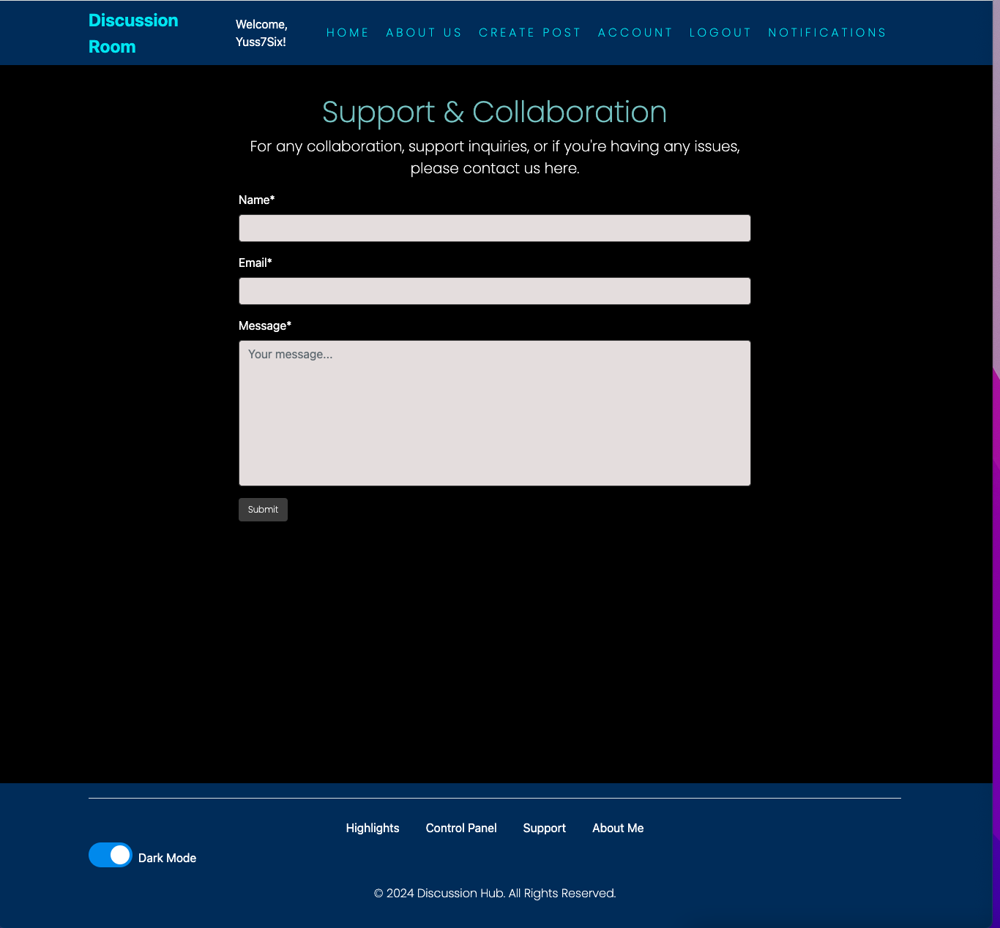

*About Me Dark Mode Mobile* 
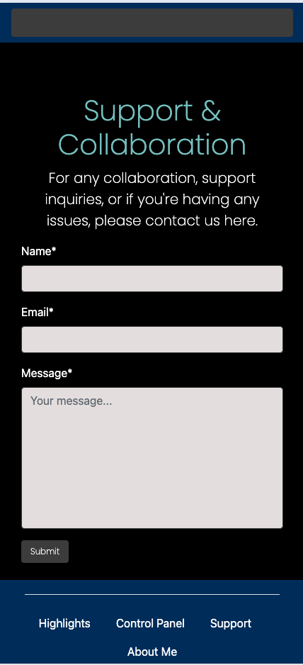

## Control Panel (Dark Mode)

The Admin Control Panel is presented against a dark background, featuring striking blue titles that enhance the visibility and hierarchy of information. The overall blue color scheme conveys a professional and authoritative appearance, suitable for administrative functions.

Within the control panel, users can expect to see various icons—such as "x" for deletion, pencil icons for editing, and plus signs for adding content—styled in a vibrant green color. This choice of color not only adds visual interest but also clearly indicates actions that can be taken within the panel.

The combination of blue titles, white text, and green action icons creates a cohesive and user-friendly interface, ensuring that administrators can manage the forum efficiently and intuitively while maintaining a pleasant visual environment.

*About Me Dark Mode Desktop* 

*About Me Dark Mode Mobile* 

## Highlights Page (Dark Mode)

The Highlights Page is presented in a nice grey window with a prominent blue title and white content. This section expresses gratitude to Code Institute for providing the resources and support to bring this project to life. 

Special thanks to the tutors and my mentor, Iuliia Konovalova, for their invaluable guidance throughout my learning journey. I also appreciate the GitHub team for their collaboration platform.

For more information about Code Institute, visit their website: https://codeinstitute.net/se/, highlighted in an engaging orange color.

*Highlights Page Dark Mode Desktop* 

*Highlights Page Dark Mode Mobile* 

## User Access (Logged In)
As a logged-in user, I will present the sections that can only be accessed when you are logged into the forum. All the sections outlined previously, including the main page, are available in your logged-in session. 

* The Home button brings you back to the main page, while the About Us section and the footer links remain accessible, providing a seamless and familiar navigation experience within the forum.

## Create a New Post (Dark Mode)

In the Create a New Post section in dark mode, users will find a visually appealing dark grey container featuring a vibrant blue title accompanied by a soft white subphrase for clarity.

This section includes three input fields styled in a soft cream white, allowing for a pleasant input experience:

* Title
* Content
* Category

The Publish button stands out with a dark grey background and white text, complemented by a nice green border, ensuring it is clearly visible. Additionally, there is a Go Back button available for users who wish to cancel the post creation process.

To inspire users, two motivational phrases are included, creating a positive atmosphere for composing new posts.

<*Create a New Post Page Dark Mode Desktop* 

<*Create a New Post Page Dark Mode Mobile* 

## Account Page (Dark Mode)

The Account Page in dark mode features a visually appealing layout with a main container that has a soft white background. Within this container, there is another internal container, also in white, which includes a bar with a blue background displaying the text "Your Account Overview" in black letters.

The user’s avatar is presented in a circular format, accompanied by the username displayed in blue and the email address in grey for clear differentiation. 

Additionally, the section includes “Connect with Us” text in blue, followed by links to social media profiles. These links feature hover effects for enhanced interactivity and user engagement.

At the bottom of the page, users will find a button for Update Profile, enabling them to make changes to their account details easily.

*Account Page Dark Mode Desktop* 

*Account Page Dark Mode Mobile* 

## Edit Profile Page (Dark Mode)

The Edit Profile Page is designed with a pleasing soft white container that features a bold blue title, clearly indicating the purpose of the page. Within this container, users will find input fields for updating their username and email, set against a grey background for easy readability.

Additionally, there is a dedicated section for changing the avatar image. This section displays the current profile photo, allowing users to easily see what the existing image is before making changes.

At the bottom of the page, there is a Save Changes button with an attractive dark grey background and white text, enabling users to apply their updates. Next to it, a simple link in blue allows users to Cancel and go back, providing an easy option to exit without saving changes.

*Edit Profile Dark Mode Desktop* 

*Edit Profile Dark Mode Mobile* 
