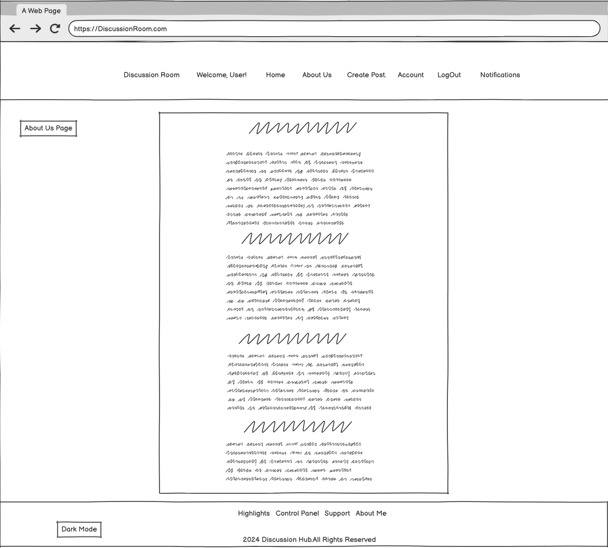
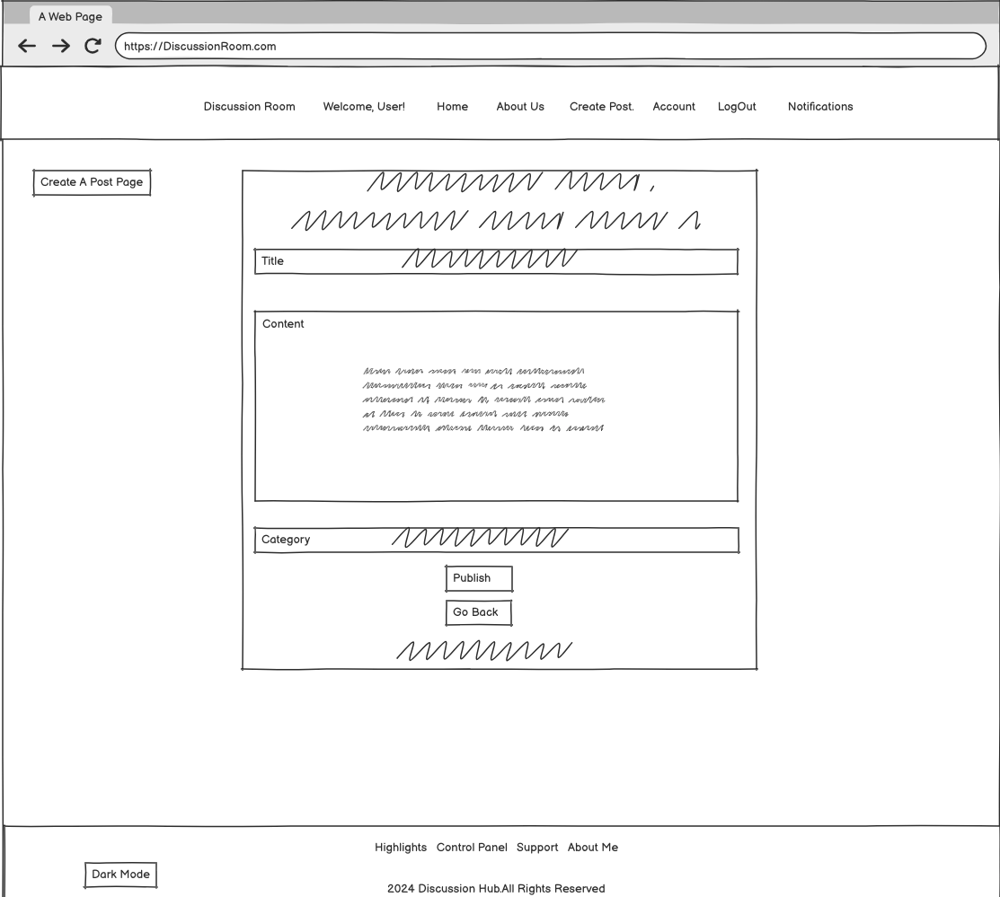
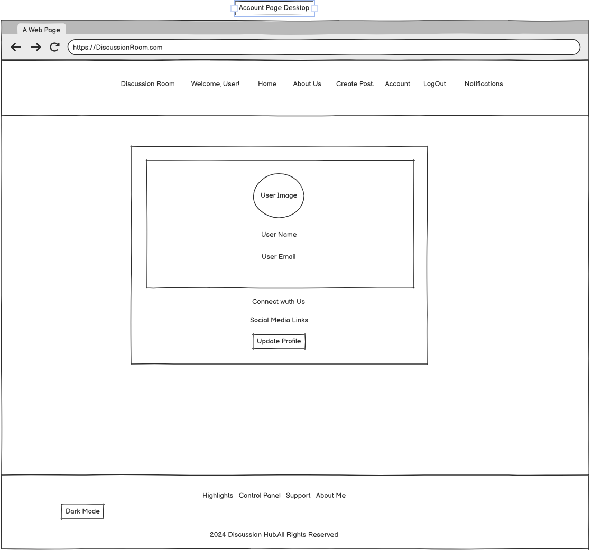
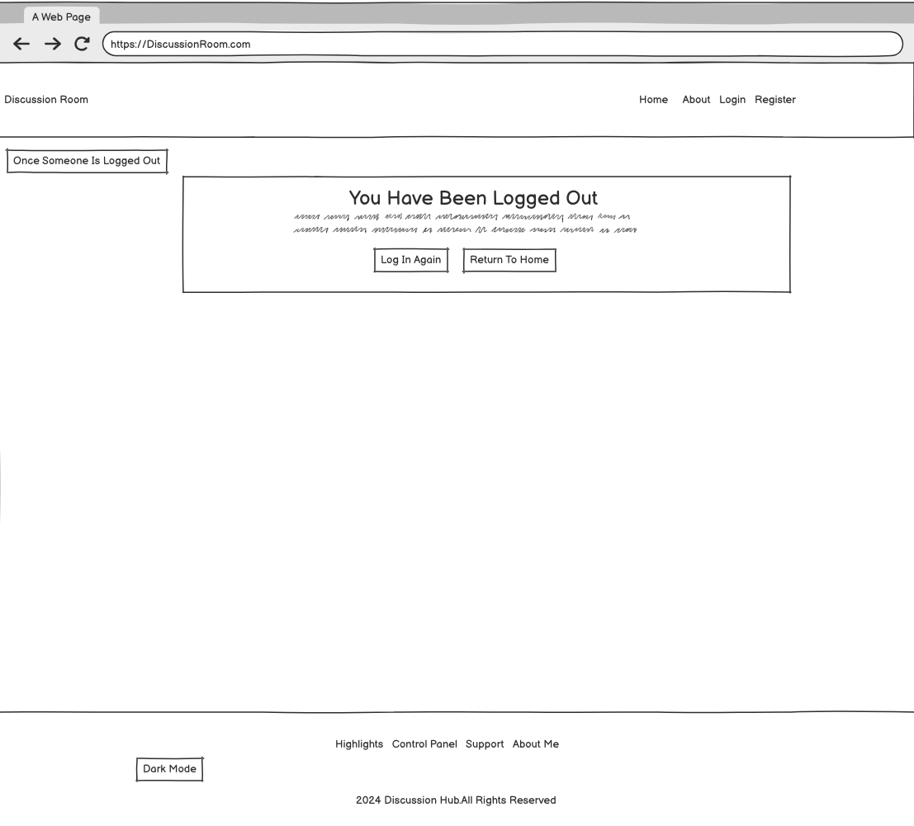
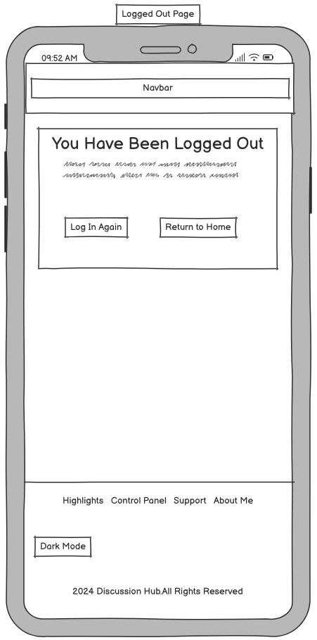

# Discussion Room

## Introduction

Discussion Room is a user-friendly forum application designed to facilitate engaging and structured discussions among users. Built with Django, this project serves as my Project 4 for the CodeInstitute Full Stack Software Development Diploma. It provides a platform where users can create, share, and discuss topics of interest, fostering a collaborative environment for exchanging ideas and knowledge.

## User Stories 

1. User Login Functionality

* As a registered user, I want to log in to my account so that I can access my personalized content and participate in discussions.

2. User Registration and Authentication

* As a new user, I want to register for an account so that I can start participating in discussions.
* As a user, I want to log out of my account for security reasons when I’m finished using the platform.

3. Post Creation Functionality

* As a user, I want to create new posts on topics of my choice so that I can share my opinions and ideas with others.

4. Post Editing Functionality

* As a user, I want to edit my posts so that I can correct mistakes or update information after it has been published.

5. Comment Deletion Functionality

* As a user, I want to delete comments I have made so that I can remove anything I no longer wish to be visible.

6. Post Deletion Functionality

* As a user, I want to delete my posts if I want to remove them from the platform entirely.

7. Comment Editing Functionality

* As a user, I want to edit my comments so that I can fix errors or add additional information to my original thoughts.

8. User Account Management for Admins

* As an admin, I want to manage user accounts so that I can enforce community guidelines and maintain a safe environment for discussions.
* As an admin, I want to view user activity to monitor interactions and ensure compliance with the platform's standards.

9. Commenting Functionality

* As a user, I want to comment on posts to express my thoughts and engage in discussions with other users.

### Admin Stories

1. User Account Management

* As an admin, I want to create user accounts so that new users can register and participate in discussions.
* As an admin, I want to view a list of all user accounts so that I can manage user access and activity.
* As an admin, I want to disable or delete user accounts so that I can remove users who violate community guidelines or no longer participate.

2. Post Management

* As an admin, I want to view all posts on the platform so that I can monitor discussions and ensure they align with community standards.
* As an admin, I want to delete posts that are inappropriate or violate community guidelines so that I can maintain a respectful discussion environment.
* As an admin, I want to edit posts to correct any misinformation or update content when necessary.

3. Comment Management

* As an admin, I want to view all comments made on posts so that I can ensure discussions remain constructive.
* As an admin, I want to delete comments that are offensive or inappropriate to keep the platform safe for users.
* As an admin, I want to manage reported comments or posts that users flag to investigate and take appropriate action.

4. Moderation Tools

* As an admin, I want to receive notifications about user reports on posts or comments so that I can respond promptly and uphold community standards.
* As an admin, I want to ban users for repeat offenses to protect the community from disruptive behavior.

### Website Goals

1. Foster Community Engagement:

* Create a welcoming space where users can freely discuss various topics, share ideas, and connect over shared interests.
* Encourage users to participate by providing tools for posting, commenting, and liking content.

2. Facilitate Knowledge Sharing:

* Provide a platform where users can ask questions and receive answers, promoting learning and understanding within the community.
* Highlight valuable contributions through features such as trending posts or top contributors.

3. Ensure User Safety and Moderation:

* Implement moderation tools and guidelines to maintain a respectful environment.
* Create mechanisms for users to report inappropriate content, helping to manage community standards effectively.

4. Enhance User Experience:

* Design a user-friendly interface that is easy to navigate, enabling users to quickly find discussions relevant to their interests.
* Optimize the site for responsiveness across various devices, ensuring accessibility for all users.

5. Support User Account Management:

* Allow users to easily register, log in, and manage their profiles, posts, and comments.
* Implement account security measures to protect user data and privacy.

6. Implement Robust Search and Filter Options:

* Provide powerful search functionality and category filtering to help users find specific discussions or topics quickly.
* Enhance user engagement by making content discovery intuitive and straightforward.

6. Promote Interaction through Notifications:

* Keep users informed about replies to their comments, likes, and new posts relevant to their interests, encouraging them to return to the site.
* Use notifications strategically to enhance user engagement and activity on the platform.

### Requirements 

* Landing page.
* About section.
* User registration and login.
* Post creation and management.
* Commenting functionality.
* Categories for filtering posts.
* Search functionality for posts.
* Trending posts section.
* User profile management.
* Admin dashboard access.
* CRUD functionality for posts and comments.
* User notifications system.
* Responsive design.
* Links to social media.

## Design Choices 

### Fonts

[Google Fonts](https://fonts.google.com/ "Google Fonts") The Discussion Room website utilizes [Poppins](https://fonts.google.com/specimen/Poppins) for headings, ensuring a modern and clean aesthetic, while Arial serves as the primary font for body text due to its simplicity and readability.

### Colours

1. rgb(230, 230, 250)

Purpose: Background color for the body of the website, creating a soft and inviting atmosphere.

2. #444444

Purpose: Primary text color for headings (h1, h2, etc.) and paragraphs (p), ensuring good readability.

3. rgba(30, 15, 45, 1) and rgba(70, 50, 120, 1)

Purpose: Used in the background of the .bg-steel class, providing a linear gradient effect that adds visual interest.

4. #003366

Purpose: Background color for the custom navbar, giving it a deep, professional look.

5. #d1e7dd

Purpose: Color for navigation links in the navbar, creating a clear contrast against the navbar background.

6. #ffffff

Purpose: Hover color for navigation links, ensuring visibility and interaction clarity.

7. #fefefe

Purpose: Background color for sections with the .content-section class, creating a clean and light appearance for content areas.

8. #000000

Purpose: Primary color for article titles, providing a strong contrast that makes the titles stand out.

9. #908690

Purpose: Hover color for article titles, adding a subtle change to indicate interactivity.

10. #dcdcdc

Purpose: Border color for .article-metadata, providing a subtle division between metadata and content.

11. #f5f5f5

Purpose: Background color for comments, ensuring they are distinguishable from the main content area.

12. #007bff

Purpose: Color for links in notifications and other emphasized text, providing a vibrant, clickable appearance.

13. #6c757d

Purpose: Default color for navbar links, offering a neutral tone that fits well within the overall design.

14. #343a40

Purpose: Default button background color, providing a dark contrasting color that highlights interactive elements.

15. #495057

Purpose: Button hover color, slightly lighter than the default, enhancing the visual indication when a user interacts with buttons.

16. #e6e6fa

Purpose: Text color for welcome messages, contributing to a lighter overall tone for user greetings.

17. #121212 and #ffffff (used in dark mode styles)

Purpose: Background and text colors respectively for dark mode support, ensuring sufficient contrast and readability.

18. #f8f9fa

Purpose: Background color for the account section and highlights, contributing to a clean and modern look.

19. #03e9f4

Purpose: Color used for various hover effects and highlights, providing a vibrant shade that draws attention.

20. #b2c39c

Purpose: Hover color for authentication links, creating an appealing visual effect when interacted with.

21. #777575

Background for content sections in dark mode.

22. #28a745

Color used for likes, visually indicating positive feedback or approval.

23. #dc3545

Color used for dislikes, indicating negative feedback or disapproval.

24. #FFA500

Color used for Code Institute promotional links, drawing attention and encouraging user interaction.

## Dark Mode Specific Colors

1. #000000

This is used as the background color for the entire site when dark mode is activated

2. Primary Text Color:

#FFFFFF: This is the primary text color used in dark mode to ensure high contrast against the black background for legibility.

3. Comment Background:

#777575: This color is assigned to the background of comments when dark mode is active, distinguishing them from the main content.

4. Highlight Color for Effects:

#03e9f4: This color is often used for elements that require attention, such as links or buttons, maintaining visibility in dark mode.

5. Muted Text Color:

#E6E6FA: This is a subtle, softer color reserved for muted text in dark mode, providing a visual hierarchy without causing strain against the darker background.

## Color Choices 

Certainly! Here’s a suggested text to add to your README file regarding the color choices and a note about the potential for missing colors, along with an improvised touch to enhance the tone:

Color Choices
In developing the Discussion Room project, I've carefully selected and noted the colors used to create an engaging and visually appealing website. The goal was to design a platform that not only facilitates discussions but also captures the attention of users through thoughtful color usage.

The colors chosen aim to provide a harmonious balance that enhances readability, establishes a welcoming atmosphere, and encourages interaction. Here is a comprehensive list of the colors used, along with their purposes.

While I have made an effort to document all the colors in use, it’s possible that a few may have been overlooked in the process. Should any colors be missing, they will be added to future updates as we continue to enhance the user experience and aesthetic appeal of the site.

By implementing this color scheme, I aspire to create a vibrant yet cohesive environment that invites users to explore, share, and engage in meaningful conversations within the community.

## Color Palette 

For the color palette, I used [Color Palette](https://coolors.co/).

## Icons

The icons used for the site were sourced from [Font Awesome](https://fontawesome.com/ "Font Awesome")

## Structure

The Discussion Room provides a simple yet engaging web platform, aiming to establish its unique color scheme and style. The navigation bar includes several links, offering quick access to various sections, such as About Us, Create a Post, Home Page, Logout, and the Notifications Page.

The footer features additional links for Highlights, Collaboration Requests, About the Team, and the Admin Page, ensuring users can easily find important information. 

Additionally, the site includes a Trending Topics section that showcases random posts and a dedicated Advertisement Window for promotional content. Above the trending topics, users will find Categories to help them navigate discussions more effectively.

To fully engage with the content—whether by commenting or posting—users must register for an account, fostering a community of committed participants.

### Database Models

User Profile (Account): 

| Object             | Field           |
|--------------------|-----------------|
|      user          |  OneToOneField  |
|      avatar        | CloudinaryField |

Post: 

| Object         | Field           |
|----------------|-----------------|
|   title        |    CharField    |
|  content       |    TextField    |
|  author        |    ForeignKey   |
| date_posted    |   DateTimeField |
| category       |   ForeignKey    |

Comment: 

| Object         | Field           |
|----------------|-----------------|
|   content      |    TextField    |
|    post        |    ForeignKey   |
|    author      |    ForeignKey   |
|  created_at    |  DateTimeField  |
|   likes        |   IntegerField  |
|  dislikes      |   IntegerField  |
|   parent       |    ForeignKey   |

Notification: 

| Object         | Field           |
|----------------|-----------------|
|   user         |    ForeignKey   |
|  message       |    CharField    |
|  is_read       |    BooleanField |
| created_at     |    DateTimeField|
| comment        |    ForeignKey   |

Category: 

| Object         | Field           |
|----------------|-----------------|
|   name         |    CharField    |

## Wireframes

Wireframes have been created using [Balsamic](https://balsamiq.com "Balsamic"). These wireframes provided an initial blueprint for the layout of my forum project. However, the design evolved and adapted throughout the development process, resulting in some changes in the final product.

*Main Page Desktop Wireframe* 

*Main Page Mobile Wireframe* 

*About Us Desktop Wireframe* 

*About Us Mobile Wireframe* 

*Create Post Desktop Wireframe* 

*Create Post Mobile Wireframe* 

*Account Page Desktop Wireframe* 

*Account Page Mobile Wireframe* 

*Logged Out Window Desktop Wireframe* 

*Logged Out Window Mobile Wireframe* 

*Notifications Page Desktop Wireframe* 

*Notifications Page Mobile Wireframe* 

*About Me Page Desktop Wireframe* 

*About Me Page Mobile Wireframe* 

*Support Page Desktop Wireframe* 

*Support Page Mobile Wireframe* 

*Highlights Page Desktop Wireframe* 

*Highlights Page Mobile Wireframe* 

*Reading Post Desktop Wireframe* 

*Reading Post Mobile Wireframe* 

## Note

As with many forums and web pages, the mobile wireframe reflects the layout users will see when they interact with the site on smaller screens. When viewing the forum on mobile, users will need to scroll down to access all content on the page. The design shown in the mobile wireframe illustrates the initial view, while scrolling reveals the complete set of features and discussions.